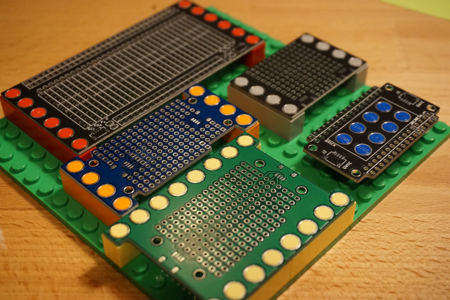

# Brick Boards

Boards designed to be compatible with LEGO and other plastic building blocks.

There are KiCAD footprints for a variety of different brick arrangements in [the parts folder](./parts/brick-4_9id-6_0od.pretty/). I've also included a number of personal projects using these footprints in the `boards/` folder.

## LICENSE

The contents of the `parts/brick-4_9id-6_0od.pretty/` folder are licensed under a CC0 license.
